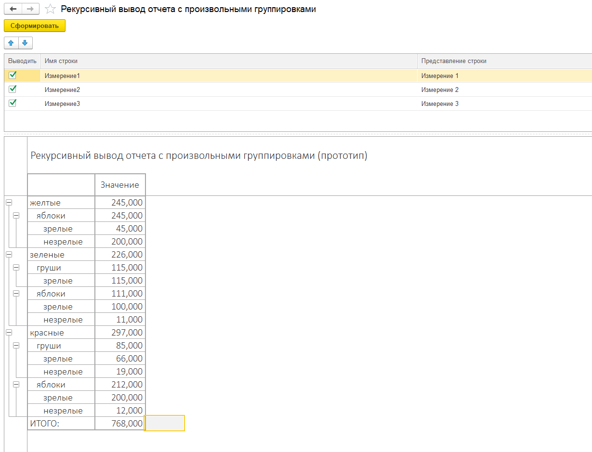
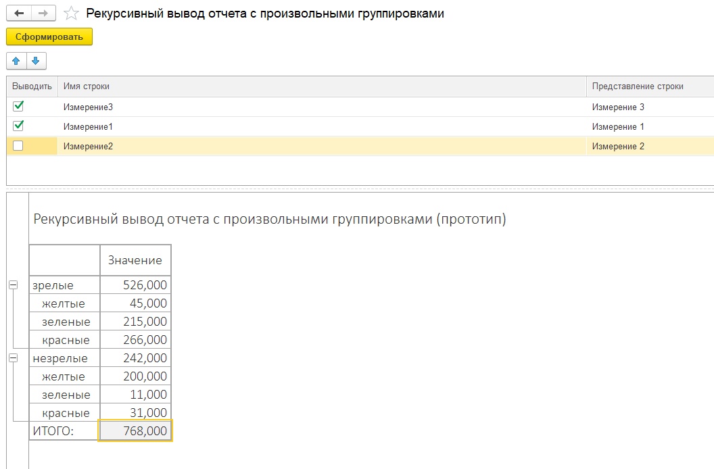
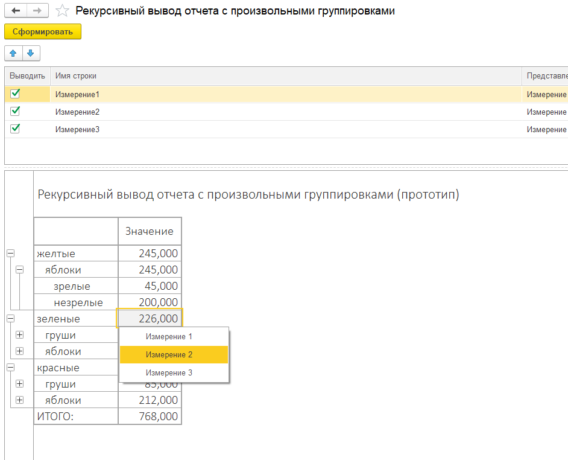
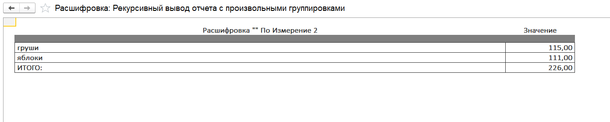

# Classic
# Отчет компонует и выводит таблицу данных в иерархическую структуру, реализован самыми базовыми средствами, с помощью чего достигается полный контроль за каждой ячейкой.
# Возможные(и успешные) применения:
1. расчетные ячейки со сложными формулами,
2. сложные многокомпонентные ячейки, например "план","факт","разница с планом абсолютная","разница с планом относительная"
3. применение визуальных стилей более очевидными средствами
4. произвольные расшифровки более очевидными средствами
# Бонусы, реализованные в прототипе:
1. подгон ширины колонок к данным
2. расшифровка ячеек по измерениям, и дальнейшая расшифровка полученных расшифровок
# Бонусы, реализованные в других проектах, отсутствуют в прототипе:
1. интеграция в подсистему рассылок типовых конфигураций, в т.ч. многостраничных xls-файлов
2. реализация многостраничных отчетов в т.ч. для пункта 1
3. горизонтальные группировки, например по месяцам
4. оптимизированная система расшифровок, для отчетов с более чем 100000 ячеек
# конфигурация любая, прототип отвязан от зависимостей

# Скриншоты

