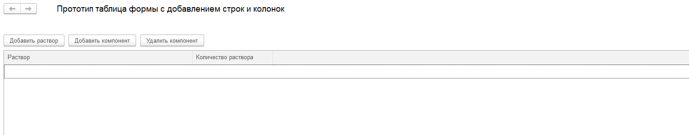
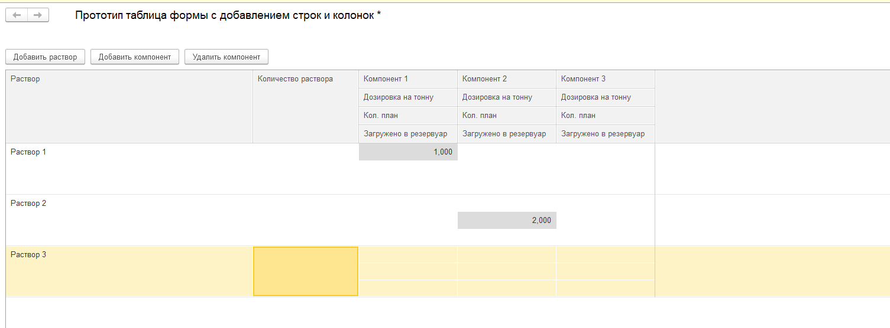

# На форме связаны две таблицы, отдельно для строк и для колонок, и реализован интерактивный ввод данных вниз и вширь
# Бонусы, реализованные в прототипе:
1. раскраска отредактированных числовых ячеек
2. выравнивание ширин добавляемых колонок, если таблиц формы с общими компонентами будет несколько - добавляемые колонки будут визуально идентичны
# конфигурация любая, прототип отвязан от зависимостей

# Скриншоты

