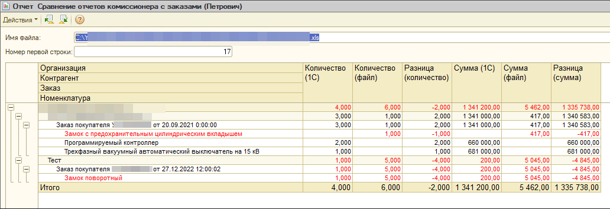

# Отчет считывает данные xls-файла, по заданным правилам производит сопоставление справочников по наименованиям/кодам, приводит числовые значения, выводит отчет по разницам количества/сумм в документе и в соответствующих заказах базы
# конфигурация "Управление торговлей", редакция 10.3 (10.3.73.1) 

# Скриншоты

