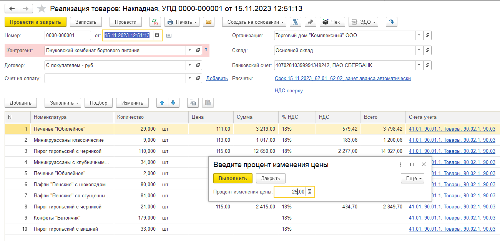

# обработка вычисляет цены на основании количественных и суммовых остатков 10-ых счетов, запрашивает процентную скидку/наценку и заполняет колонку Цена в документе реализации с пересчетом итогов
# конфигурация Бухгалтерия предприятия, редакция 3.0 (3.0.143.42)

# Скриншоты

