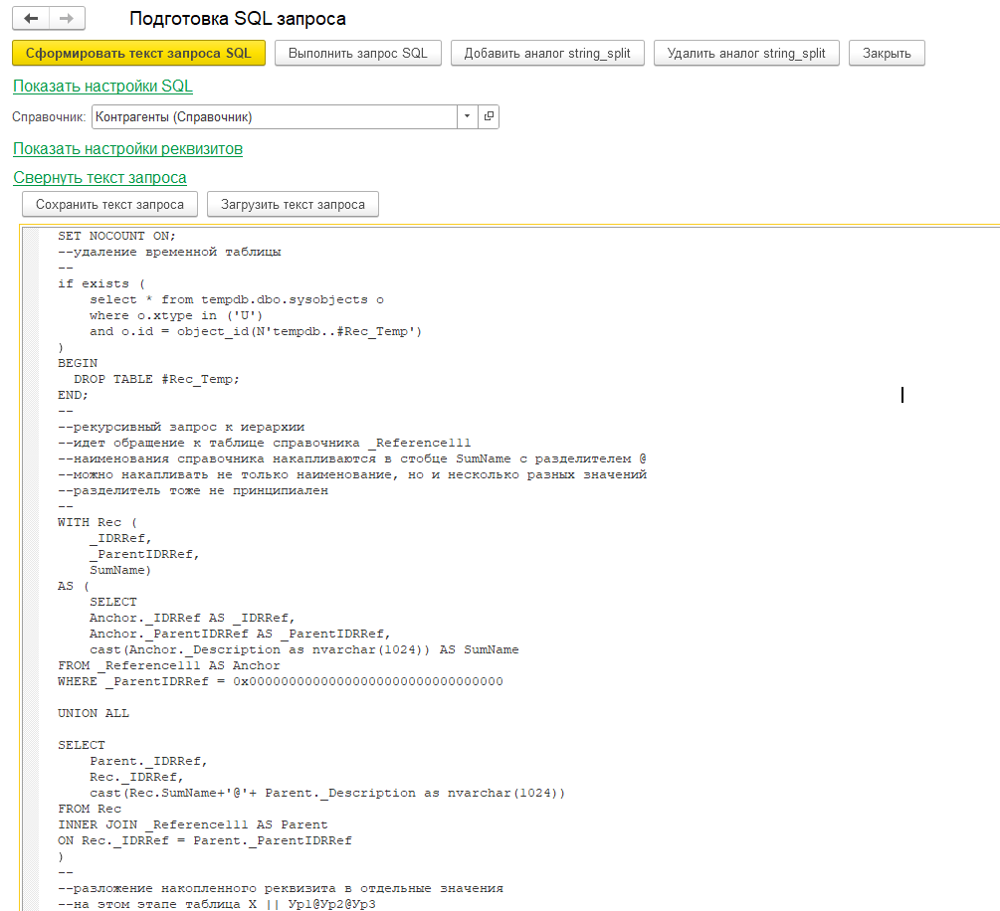

# Обработка генерирует текст SQL-запроса, с помощью ADODB.Connection выполняет его с разбором результата
# конфигурация Бухгалтерия предприятия, редакция 3.0 (3.0.143.42)
# Бонусы, реализованные в прототипе:
1. преобразование иерархии справочника в отдельные колонки level1,...,levelN
2. разбор результата с преобразованием ссылочных полей MS SQL в UUID внутренней структуры хранения, обработкой булевых значений и значений-дат

# Скриншоты

